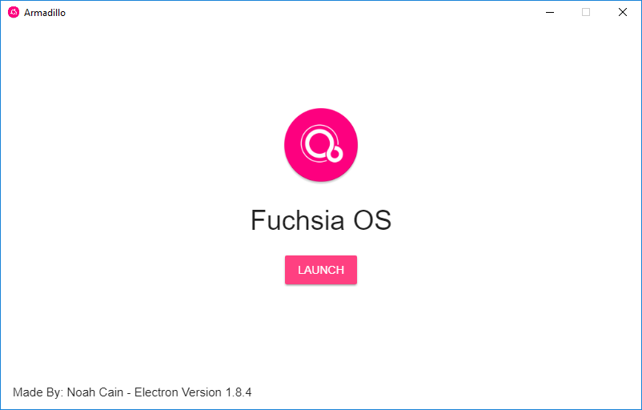
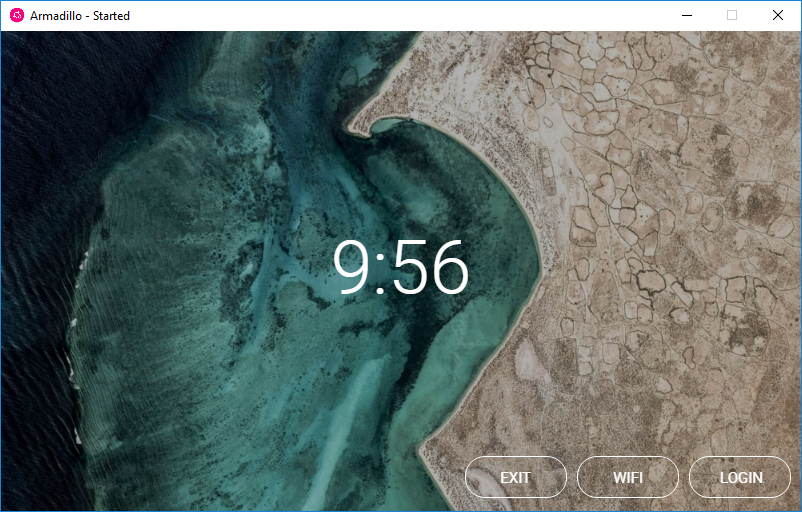

# armadillo-electron
armadillo-electron allows you to run the armadillo ui on Windows. It was written in HTML and utilizes electron. Download as a zip and go to release-builds/armadillo-win32-ia32 and run armadillo.exe. I am quite inexperienced with electron (My first project!) so the files are kind of disorganized.

# Additional Information
If you want to send suggestions or questions, feel free to email nmcain@gmail.com.
